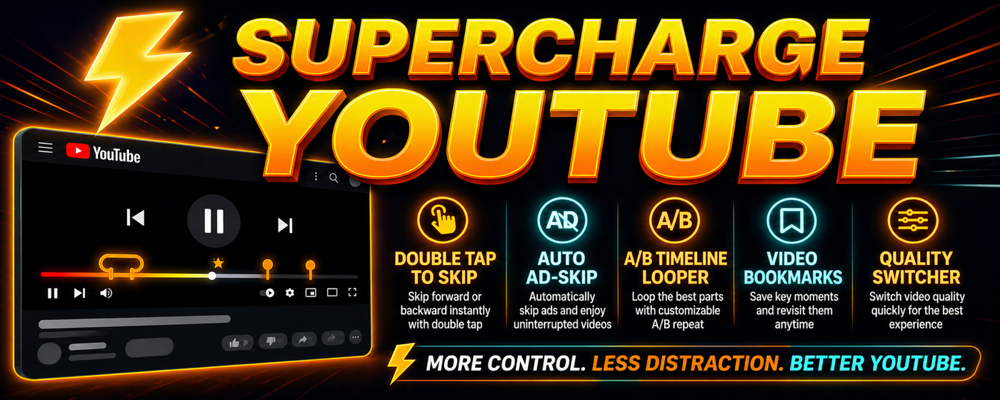

# YouTube Feature Enhancer

This repository serves as the public tracker and promotional landing page for the **YouTube Feature Enhancer** browser extension.

## About The Extension

YouTube Feature Enhancer supercharges your YouTube viewing experience with native UI integrations. Features include:
- Auto Ad-Skipper
- Smart Double-Tap to Skip
- A/B Timeline Looper
- Frame-Accurate Bookmarks
- Quick Quality Switcher

*(Note: The actual extension source code is maintained in a private repository to protect its proprietary click-interception algorithms and heatmap parsers.)*

## Screenshots

Here is a look at the extension in action:

<table>
  <tr>
    <td></td>
    <td></td>
  </tr>
  <tr>
    <td></td>
    <td></td>
  </tr>
  <tr>
    <td></td>
    <td></td>
  </tr>
  <tr>
    <td></td>
    <td></td>
  </tr>
  <tr>
    <td colspan="2"></td>
  </tr>
</table>

## Feedback & Changes

We are constantly looking to improve! If you encounter a bug, have a feature request, or want to suggest changes, please open an issue!

1. Go to the **Issues** tab at the top of this repository.
2. Click **New Issue**.
3. Provide as much detail as possible so we can look into it right away.

---
*Created to make studying and watching videos better.*
